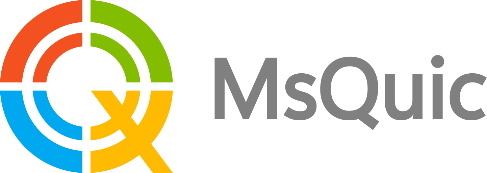

<h1 align="center"></h1>

MsQuic is a Microsoft implementation of the [IETF QUIC](https://datatracker.ietf.org/wg/quic/about/)
protocol. It is cross-platform, written in C and designed to be a general purpose QUIC library. MsQuic also has C++ API wrapper classes and exposes interop layers for both [Rust](https://docs.rs/msquic/latest/msquic/) and C#.

> [!TIP]
> You are using MsQuic? Let us know! Knowing our users lets us prioritize work and keep improving MsQuic in the best possible direction.
> Post in the [Discussion](https://github.com/microsoft/msquic/discussions/4963) to say hello and give us a wave on [Discord](https://discord.gg/YGAtCwTSsc)!

## Protocol Features

QUIC has many benefits when compared to existing "TLS over TCP" scenarios:

  * All packets are encrypted and handshake is authenticated with TLS 1.3.
  * Parallel streams of (reliable and unreliable) application data.
  * Exchange application data in the first round trip (0-RTT).
  * Improved congestion control and loss recovery.
  * Survives a change in the clients IP address or port.
  * Stateless load balancing.
  * Easily extendable for new features and extensions.

## Library Features

MsQuic has several features that differentiates it from other QUIC implementations:

  * Optimized for client and server.
  * Optimized for maximal throughput and minimal latency.
  * Asynchronous IO.
  * Receive side scaling ([RSS](https://docs.microsoft.com/en-us/windows-hardware/drivers/network/introduction-to-receive-side-scaling)) support.
  * UDP send and receive coalescing support.
  * Kernel stack bypass via [XDP](https://github.com/microsoft/xdp-for-windows?tab=readme-ov-file#xdp-for-windows).

# Documentation

  * For platform support details, see the [Platforms docs](./docs/Platforms.md).
  * For release details, see the [Release docs](./docs/Release.md).
  * For performance data, see the [Performance dashboard](https://aka.ms/msquicperformance).
  * For building the library, see the [Build docs](./docs/BUILD.md).
  * For testing the library, see the [Testing docs](./docs/TEST.md).
  * For using the API, see the [API docs](./docs/API.md) or the [Sample](./src/tools/sample/sample.c).
  * For running a sample server and client app, see the [Quick Start Guide](./docs/Sample.md).
  * For deploying QUIC, see the [Deployment docs](./docs/Deployment.md).
  * For diagnosing issues, see the [Diagnostics docs](./docs/Diagnostics.md) and the [Trouble Shooting Guide](./docs/TroubleShootingGuide.md).
  * For other frequently asked questions, see the [FAQs](./docs/FAQ.md).

# Contributing

For information on contributing, please see our [contribution guidelines](./.github/CONTRIBUTING.md). Feel free to take a look at our [Good First Issues](https://github.com/microsoft/msquic/labels/good%20first%20issue) list if you're looking for somewhere to start. If you'd just like to talk, come chat with us [on Discord](https://discord.gg/YGAtCwTSsc).
