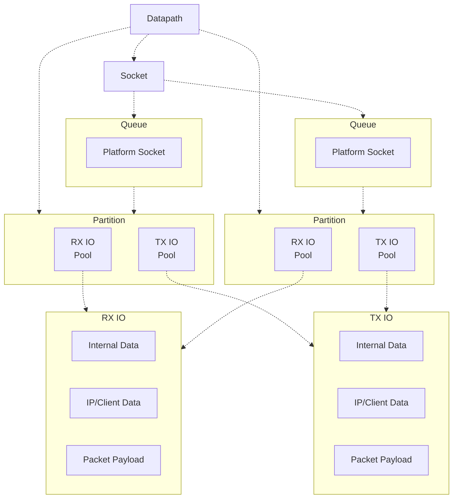

Architecture
======

MsQuic has primarily two high-level layers: QUIC and the platform. The platform layer includes
abstractions for TLS, UDP and OS stuff (like threads and locks). The QUIC layer is platform
independent logic, built on the platform abstraction layers.

# Component Breakdown

## Platform Abstraction Layer

The platform abstraction layer (or PAL) supports the following platforms:

- Windows (User and Kernel)
- Linux
- FreeBSD
- macOS

### Basic OS Interfaces

The most fundamental part of the PAL is definitions of basic constructs like locks, events, interlocked operations, threads, and time. Most of these definitions are implemented inline in C macros. The goal is to minimize overhead and simply be a minimal abstraction for various interfaces.

### Datapath

Another large piece of the PAL is the abstraction of UDP and TCP sockets, named the "datapath" layer. This layer is designed to be highly parallelized and performant.

It uses asynchronous callbacks driven by the current execution model (see [below](#execution-model)) threads.

Currently, it also has preview support of XDP on Windows.

There are a few high-level concepts for the datapath implementations:

- **Datapath** - The top-level, public object that is used to create and manage all other options. It sets up multiple partitions for the given execution mode.
- **Parition** - An internal object used to isolate different instances of data for performance. By isolating the data, sockets can be efficiently parallelized, usually on different processors. They maintain a pool for RX and TX IO blocks.
- **Socket** - The public object that exposes a highly parallelized interface for sending and receiving packets in the current execution mode and partitions.
- **Queue** - Another internal object used in conjunction with partitions to parallelize the work of a given socket.
- **RX/TX IO** - A contiguous block of memory containing both internal/external metadata as well as the payload buffers. If batching (e.g. USO/URO) is supported by the datapath, then multiple IO blocks may be allocated together and organized slightly differently.

### Crypto

The PAL exposes various cryptographic interfaces as well, such has encryption/decryption and cryptographic hashing. This layer currently supports BCrypt and OpenSSL variants on Windows, and OpenSSL on Linux.

### TLS

Related to Crypto, the TLS layer abstracts the necessary TLS functionality required by the QUIC protocol. This layer currently supports Schannel and OpenSSL variants on Windows, and OpenSSL on Linux.

### Platform Initialization

The platform layer isn't completely stateless, and requires some setup and cleanup. This is split into two layers:

#### Library Load

This is when the library is loaded into memory, and does very minimal work, such as initializing some global state, and generally cannot fail.

See `CxPlatSystemLoad` and `CxPlatSystemUnload` in the code for more details.

#### Library Initialization

This is when the library is first used by the upper layer(s). It does the rest of the work, especially the more intensive work that may fail under extreme circumstances (missing dependencies or OOM).

See `CxPlatInitialize` and `CxPlatUninitialize` in the code for more details.

## QUIC

The QUIC layer builds on the abstractions exposed by the PAL to implement platform-independent protocol logic of the QUIC protocol.

> **TODO** - Add details

# Execution Model

The execution model refers to how and where work is scheduled and executed.

> **TODO** - Add details
