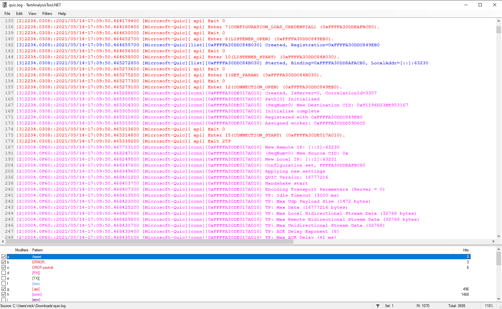
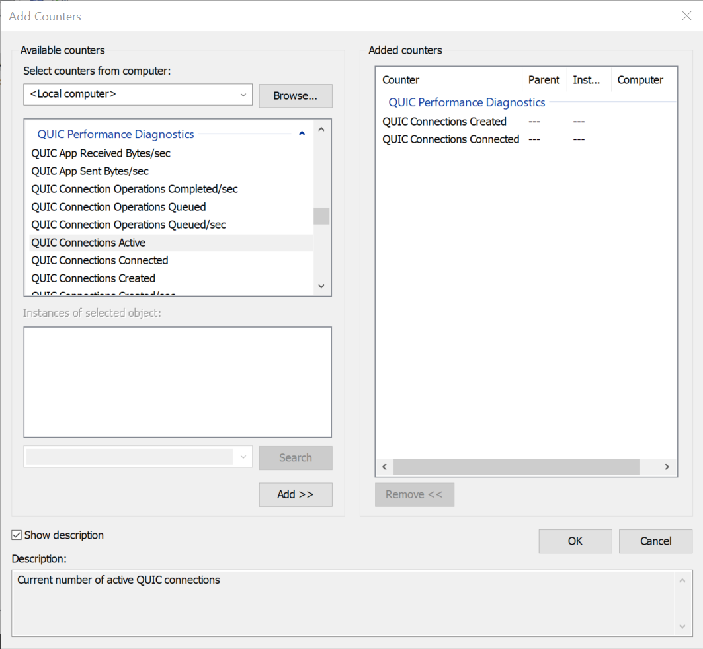

# Diagnosing Issues with MsQuic

This document describes various ways to debug and diagnose issues when using MsQuic.

# Built-in Tracing

For debugging issues, logging is generally the best way to diagnose problems. MsQuic has extensive logs in the code to facilitate debugging. The logs can simply be converted to human readable text or they can be processed by various automated tools to help improve diagnostics.

> **Note**
> Currently tools only support Windows ETW.

### Windows

On Windows, MsQuic leverages manifested [ETW](https://docs.microsoft.com/en-us/windows/win32/etw/event-tracing-portal) for its logging. All dependencies should be included with Windows; nothing additional should be required.

### Linux

On Linux, MsQuic leverages [LTTng](https://lttng.org/features/) for its logging. Some dependencies, such as babeltrace, lttng, and clog2text_lttng are required. The simplest way to install all dependencies is by running `./scripts/prepare-machine.ps1 -ForTest`, but if you only want to collect the traces on the machine, the **minimal dependencies** are:

```
sudo apt-add-repository ppa:lttng/stable-2.12
sudo apt-get update
sudo apt-get install -y lttng-tools
```

### macOS

Tracing is currently unsupported on macOS.

# Trace Collection

## Windows

 There are a lot of general tools and ways to collect and interact with ETW. In the sections below are our recommended ways to collect and consume the MsQuic ETW logs. [MsQuicEtw.man](../src/manifest/MsQuicEtw.man) specifies all the details for each event. For instance:

 ```xml
    <event
        keywords="ut:Connection ut:DataFlow"
        level="win:Verbose"
        message="$(string.Etw.ConnOutFlowStats)"
        opcode="Connection"
        symbol="QuicConnOutFlowStats"
        template="tid_CONN_OUT_FLOW_STATS"
        value="5140"
        />
```

This details everything about the `QuicConnOutFlowStats` event (see `ConnOutFlowStats` in the code), including it's `level` (`verbose`) and it's `keywords` (`ut:Connection` and `ut:DataFlow`). So this event would be collected if the level is `5` or higher and either the `ut:Connection` or the `ut:DataFlow` keywords are configured.

The numeric value for the keywords is at the top of the manifest file:

```xml
    <keyword
        mask="0x0000000000000020"
        name="ut:Connection"
        />
    <keyword
        mask="0x0000000040000000"
        name="ut:DataFlow"
        />
```

 ### netsh.exe

`netsh.exe` (short for Net Shell, but generally pronounced "net-s-h") is an inbox Windows command line tool. It has many uses, but one of the most used is around tracing (at least for the networking community).

To **start** collecting a trace with `netsh`, use the following command:

```
netsh.exe trace start overwrite=yes report=dis correlation=dis traceFile=quic.etl provider={ff15e657-4f26-570e-88ab-0796b258d11c} level=0x5 keywords=0xffffffff
```

There are a lot of parameters being passed and if you want the complete help text explaining them all you can run `netsh.exe trace start help`. A few of the important parameters are:

 - **traceFile** - The name/path of the output ETL file that the logs will be saved to.

 - **provider** - The GUID of the ETW provider that should be collected. In this case, `{ff15e657-4f26-570e-88ab-0796b258d11c}` is the GUID for the MsQuic provider.

 - **level** - The level at which to collect traces. `5` indicates the `verbose` level. `4` is `informational`.

 - **keywords** - The set of flags that indicate which type of events should be collected. The command above collects **all** keywords (`0xffffffff`) which may be too verbose for some scenarios, such as high throughput testing or large number of parallel connections. For a detailed list of the available keywords, see [MsQuicEtw.man](../src/manifest/MsQuicEtw.man) and see `<keywords>`.

Once you are done with collecting all the events, to **stop** the trace session, use the following command:

```
netsh.exe trace stop
```

This will flush and finalize the output ETL file specified in the `netsh trace start` command. This ETL file can either be converted to text or used in the automated tools.

### wpr.exe

`wpr.exe` is another inbox Windows command line tool that can be used to collect ETW traces, but it requires an additional "profile" file: [MsQuic.wprp](../src/manifest/MsQuic.wprp). This WPR profile file details several specifically tailored trace configurations. To use it, you must copy [MsQuic.wprp](../src/manifest/MsQuic.wprp) to the machine you wish to collect the traces for, you can simply run the following to start trace collection:

```
wpr.exe -start MsQuic.wprp!PROFILE -filemode
```

You must replace `PROFILE` with the name of the profile you want to run. Some of the useful profiles are:

- `Stacks.Light`- Collects CPU callstacks.
- `Performance.Light` - Collects performance related events useful for automated tool processing.
- `Performance.Verbose` - Collects `Performance.Light` plus CPU callstacks.
- `Basic.Light` - Collects general, "low volume" MsQuic events. Useful for a "big picture" understanding, with as few events collected as possible.
- `Basic.Verbose` - Collects all MsQuic events. This is very verbose.
- `Scheduling.Verbose` - Collects "low volume" and scheduling related MsQuic events.
- `Datapath.Light` - Collects "low volume" and datapath related MsQuic events.
- `Datapath.Verbose` - Collects `Datapath.Light` plus CPU callstacks.
- `Full.Light` - Collects all MsQuic events as well as [TAEF](https://docs.microsoft.com/en-us/windows-hardware/drivers/taef/) events. For most, this will be equivalent to `Basic.Verbose`.
- `Full.Verbose` - Collects all MsQuic events, [TAEF](https://docs.microsoft.com/en-us/windows-hardware/drivers/taef/) events and several networking components' events. This is the **most verbose** possible, and should only be used for the most minimal scenarios.

When you're done and ready to collect the logs, you run:

```
wpr.exe -stop ETL_PATH
```

You must replace `ETL_PATH` with the path of the output ETL file that you want to be written.

If you no longer need the logs being collected, you can **cancel** a trace instead of saving it to file:

```
wpr.exe -cancel
```

### Other Ways

As already indicated, there are lots of ways to collect ETW traces. Feel free to look at [Configuring and Starting an Event Tracing Session](https://docs.microsoft.com/en-us/windows/win32/etw/configuring-and-starting-an-event-tracing-session) for more information.

## Linux

To start collecting a trace, you can use the following commands:

```
mkdir msquic_lttng
lttng create msquic -o=./msquic_lttng
lttng enable-event --userspace CLOG_*
lttng add-context --userspace --type=vpid --type=vtid
lttng start
```

And to stop log the trace session, you can use the following command:

```
lttng stop msquic
```

# Trace Conversion to Text

## Windows

To convert an ETL file to human-readable text, you can use the following `netsh.exe` command:

```
netsh.exe trace convert quic.etl overwrite=yes
```

If you're using a version of MsQuic that uses an ETW manifest version more recent than the one built into the Windows image, decoding may not provide correct output. To solve this issue, newer versions of Windows (11 and Server 2022) support a `manpath` parameter that can be used to manually specify a manifest. This will likely always be needed for apps using MsQuic in user mode.

```
netsh.exe trace convert quic.etl manpath=path/to/manifest/MsQuicEtw.man
```

For older versions of Windows that don't support the `manpath` parameter, you can manually update the installed manifest that is used to decode the file. You can run the following `wevtutil.exe` commands in an **Admin** window:

```
wevtutil.exe um path\to\MsQuicEtw.man
wevtutil.exe im path\to\MsQuicEtw.man /rf:path\to\msquic.dll /mf:path\to\msquic.dll
```

Replace `path\to` with the actual paths to the respective files. With the latest manifests installed, now the normal `netsh.exe` convert command should work.

## Linux

To convert the trace, you can use the following commands:

```
babeltrace --names all ./msquic_lttng/* > quic.babel.txt
clog2text_lttng -i quic.babel.txt -s clog.sidecar -o quic.log --showTimestamp --showCpuInfo
```

> **Note**
> The `clog.sidecar` file that was used to build MsQuic must be used. It can be found in the `./src/manifest` directory of the repository.

# Trace Analysis

MsQuic supports a custom plugin for Windows Performance Analyzer (WPA) to detailed analysis of ETW traces. See the [WPA instructions](../src/plugins/trace/README.md) for more details.

## Text Analysis Tool

When viewing the traces as text, we recommend [TextAnalysisTool.NET](https://textanalysistool.github.io/) (Windows only) and we have several filter files we maintain for it ([folder](./tat)). The different filters are meant to quickly highlight and color code important information.



You may also open the trace in Windows Performance Analyzer. See the [WPA instructions](../src/plugins/trace/README.md) for more details.

> **Note**
> WPA support for LTTng based logs is not yet available but will be supported in the future.

# Performance Counters

To assist investigations into running systems, MsQuic has a number of performance counters that are updated during runtime. These counters are exposed as an array of unsigned 64-bit integers, via a global `GetParam` parameter.
Sample code demonstrating how to query the performance counters:
```c
uint64_t Counters[QUIC_PERF_COUNTER_MAX];
uint32_t BufferLength = sizeof(Counters);
MsQuic->GetParam(
    NULL,
    QUIC_PARAM_GLOBAL_PERF_COUNTERS,
    &BufferLength,
    Counters);
```

Each of the counters available is described here:
Counter | Description
--------|------------
QUIC_PERF_COUNTER_CONN_CREATED | Total connections ever allocated
QUIC_PERF_COUNTER_CONN_HANDSHAKE_FAIL | Total connections that failed during handshake
QUIC_PERF_COUNTER_CONN_APP_REJECT | Total connections rejected by the application
QUIC_PERF_COUNTER_CONN_RESUMED | Total connections resumed
QUIC_PERF_COUNTER_CONN_ACTIVE | Connections currently allocated
QUIC_PERF_COUNTER_CONN_CONNECTED | Connections currently in the connected state
QUIC_PERF_COUNTER_CONN_PROTOCOL_ERRORS | Total connections shutdown with a protocol error
QUIC_PERF_COUNTER_CONN_NO_ALPN | Total connection attempts with no matching ALPN
QUIC_PERF_COUNTER_STRM_ACTIVE | Current streams allocated
QUIC_PERF_COUNTER_PKTS_SUSPECTED_LOST | Total suspected packets lost
QUIC_PERF_COUNTER_PKTS_DROPPED | Total packets dropped for any reason
QUIC_PERF_COUNTER_PKTS_DECRYPTION_FAIL | Total packets with decryption failures
QUIC_PERF_COUNTER_UDP_RECV | Total UDP datagrams received
QUIC_PERF_COUNTER_UDP_SEND | Total UDP datagrams sent
QUIC_PERF_COUNTER_UDP_RECV_BYTES | Total UDP payload bytes received
QUIC_PERF_COUNTER_UDP_SEND_BYTES | Total UDP payload bytes sent
QUIC_PERF_COUNTER_UDP_RECV_EVENTS | Total UDP receive events
QUIC_PERF_COUNTER_UDP_SEND_CALLS | Total UDP send API calls
QUIC_PERF_COUNTER_APP_SEND_BYTES | Total bytes sent by applications
QUIC_PERF_COUNTER_APP_RECV_BYTES | Total bytes received by applications
QUIC_PERF_COUNTER_CONN_QUEUE_DEPTH | Current connections queued for processing
QUIC_PERF_COUNTER_CONN_OPER_QUEUE_DEPTH | Current connection operations queued
QUIC_PERF_COUNTER_CONN_OPER_QUEUED | Total connection operations queued ever
QUIC_PERF_COUNTER_CONN_OPER_COMPLETED | Total connection operations processed ever
QUIC_PERF_COUNTER_WORK_OPER_QUEUE_DEPTH | Current worker operations queued
QUIC_PERF_COUNTER_WORK_OPER_QUEUED | Total worker operations queued ever
QUIC_PERF_COUNTER_WORK_OPER_COMPLETED | Total worker operations processed ever
QUIC_PERF_COUNTER_PATH_VALIDATED | Total path challenges that succeed ever
QUIC_PERF_COUNTER_PATH_FAILURE | Total path challenges that fail ever
QUIC_PERF_COUNTER_SEND_STATELESS_RESET | Total stateless reset packets sent ever
QUIC_PERF_COUNTER_SEND_STATELESS_RETRY | Total stateless retry packets sent ever

## Windows Performance Monitor

On the latest version of Windows, these counters are also exposed via PerfMon.exe under the `QUIC Performance Diagnostics` category. The values exposed via PerfMon **only represent kernel mode usages** of MsQuic, and do not include user mode counters.



## ETW

Counters are also captured at the beginning of MsQuic ETW traces, and unlike PerfMon, includes all MsQuic instances running on the system, both user and kernel mode.

# Detailed Troubleshooting

For detailed trouble shooting steps please see the MsQuic [Trouble Shooting Guide](TSG.md).
