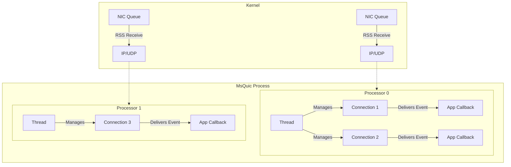

Execution
======

The MsQuic API uses a different execution model compared to BSD-style sockets and most other networking libraries built on them.
The sections below detail the designs MsQuic uses and the reasons behind these choices.

## Event Model

MsQuic [Object Model](./API.md#object-model) describes the hierarchy of MsQuic objects.

The MsQuic API delivers all state changes and notifications for a specific MsQuic object directly to the corresponding callback handler registered by the application. These include connection state changes, new streams being created, stream data being received, and stream sends completing, among others.

Example definition of Listener object callback API:

```c
typedef struct QUIC_LISTENER_EVENT {
    QUIC_LISTENER_EVENT_TYPE Type;
    union {
        struct { ... } NEW_CONNECTION;
        struct { ... } STOP_COMPLETE;
        ...
    };
} QUIC_LISTENER_EVENT;

typedef
_IRQL_requires_max_(PASSIVE_LEVEL)
_Function_class_(QUIC_LISTENER_CALLBACK)
QUIC_STATUS
(QUIC_API QUIC_LISTENER_CALLBACK)(
    _In_ HQUIC Listener,
    _In_opt_ void* Context,
    _Inout_ QUIC_LISTENER_EVENT* Event
    );
```

The application must register a callback handler for every MsQuic object it creates, as well as for some objects automatically created by MsQuic (such as those created for [Peer Initiated Streams](Streams.md#Peer_Initiated_Streams) or [Server Connections](./api/QUIC_LISTENER_EVENT.md#New_Connection)).

This handler must manage all the events MsQuic may indicate for that object. The handler must also return a status for each event indicating to MsQuic how the event was handled. This returned status is often success/failure, but sometimes indicates MsQuic that further processing is required.

This handler must return `QUIC_STATUS_SUCCESS` for all events it currently does not handle (default case) to insulate the code from future additions to list of events for a specific object.

This approach differs significantly from sockets and most networking libraries, where the application must make a call (e.g., `send` or `recv`) to determine if something happened.
This design choice was made for several reasons:

- The MsQuic API **runs in-process**, eliminating the need for a kernel to user mode boundary switch to notify the application layer. This makes the callback-based design more practical compared to sockets.

- The various events defined in MsQuic are derived from the underlying QUIC protocol. Applications may have hundreds of objects with potential state changes. The callback model allows the application to avoid synchronization/call management on each object and focus on event handling for the object.

- Writing correct, scalable code in every application built on top of the socket interfaces is a repetetive, challenging task prone to errors. Offloading the threading and synchronization to MsQuic enables every application to be scalable with minimal effort, making things "just work" out of the box.

- Simplifies MsQuic logic by eliminating a queue/cached state to track yet-to-be-delivered application notifications/data. Such state is maintained in the socket model and the networking stack must wait for call(s) from the application before indicating completion. This represents reduced code, complexity and memory usage in the MsQuic library compared to the socket model.

### Writing Event Handlers

Event handlers are **required** for all objects that can receive events, as much of the MsQuic API operates through these callbacks.
Critical events, such as "shutdown complete" notifications, provide vital information necessary for the application to function correctly.
Without these events, the application cannot determine when it is safe to clean up objects.

Applications **must** keep the execution time within callbacks **to a minimum**.
MsQuic does not use separate threads for protocol execution and upcalls to the application.
Therefore, any significant delays in the callback **will delay the protocol**.
Any substantial work required by the application **must** be performed on threads created by the application.

This does not imply that the application needs separate threads to perform all of its work.
Many operations are designed to be most efficient when executed within the callback.
For example, closing a handle to a connection or stream is ideally done during the "shutdown complete" event notification callback.

Some callbacks necessitate the application to call MsQuic API in return. Such cyclic call patterns could lead to deadlocks in a generic implementation, but not so in MsQuic.
Special attention has been paid to ensure that MsQuic API (down) calls made from a callback thread always occur inline (thus avoiding deadlocks) and will take precedence over any calls in progress or queued from a separate thread.
By default, MsQuic will **never** invoke a recursive callback to the application in these cases. The only exception to this rule is if the application opts in via the `QUIC_STREAM_SHUTDOWN_FLAG_INLINE` flag when calling `StreamShudown` on a callback.

## Threading

MsQuic creates its own threads by default to manage the execution of its logic.
The number and configuration of these threads depend on the settings passed to [RegistrationOpen](api/RegistrationOpen.md) or `QUIC_PARAM_GLOBAL_EXECUTION_CONFIG`.

MsQuic typically creates a dedicated worker thread for each processor, which are hard-affinitized to a specific NUMA node and soft-affinitized (set as 'ideal processor') to a specific processor.
Each of these threads handle both the datapath (i.e., UDP) and QUIC layers by default. QUIC may be configured to run these layers on separate threads.
Using a single worker thread for both layers helps MsQuic can achieve lower latency and using separate threads for the two layers can help achieve higher throughput.
MsQuic aligns its processing logic with the rest of the networking stack (including hardware RSS) to ensure that all processing stays on the same NUMA node, and ideally, the same processor.

The complexity of aligning processing across various threads and processors is the primary reason for MsQuic to manage its own threading.
This provides developers with a performant abstraction of both functionality and threading model, which simplifies application development using MsQuic, ensuring that things "just work" efficiently for QUIC by default.

Each thread manages the execution of one or more connections.
Connections are distributed across threads based on their RSS alignment, which should evenly distribute traffic based on different UDP tuples.
Each connection and its derived state (i.e., streams) are managed and executed by a single thread at a time, but may move across threads to align with any RSS changes.
This ensures that each connection and its streams are effectively single-threaded, including all upcalls to the application layer.
MsQuic will **never** make upcalls for a single connection or any of its streams in parallel.

For listeners, the application callback will be called in parallel for new connections, allowing server applications to scale efficiently with the number of processors.



## Custom Execution

MsQuic also supports scenarios where the application layer creates the threads that MsQuic uses to execute on.
In this mode, the application creates one or more execution contexts that MsQuic will use to run all its internal logic.
The application is responsible for calling down into MsQuic to allow these execution contexts to run.

To create an execution context, the app much first create an event queue object, which is a platform specific type:

- Windows: IOCP
- Linux: epoll
- macOS: kqueue

On Windows, the following types are defined:

```c++
typedef HANDLE QUIC_EVENTQ;

typedef OVERLAPPED_ENTRY CXPLAT_CQE;

typedef
_IRQL_requires_max_(PASSIVE_LEVEL)
void
(CXPLAT_EVENT_COMPLETION)(
    _In_ CXPLAT_CQE* Cqe
    );
typedef CXPLAT_EVENT_COMPLETION *CXPLAT_EVENT_COMPLETION_HANDLER;

typedef struct CXPLAT_SQE {
    OVERLAPPED Overlapped;
    CXPLAT_EVENT_COMPLETION_HANDLER Completion;
} CXPLAT_SQE;
```

You will also notice the definiton for `QUIC_SQE` (SQE stands for submission queue entry), which defines the format that all completion events must take so they may be generically processed from the event queue (more on this below).

Once the app has the event queue, it may create the execution context with the `ExecutionCreate` function:

```c++
HANDLE IOCP = CreateIoCompletionPort(INVALID_HANDLE_VALUE, nullptr, 0, 1);
QUIC_EXECUTION_CONFIG ExecConfig = { 0, &IOCP };

QUIC_EXECUTION* ExecContext = nullptr;
QUIC_STATUS Status = MsQuic->ExecutionCreate(QUIC_GLOBAL_EXECUTION_CONFIG_FLAG_NONE, 0, 1, &ExecConfig, &ExecContext);
```

The above code createa a new IOCP (for Windows), sets up an execution config, indicating an ideal processor of 0 and the pointer to the IOCP, and then calls MsQuic to create 1 execution context.
An application may expand this code to create multiple execution contexts, depending on their needs.

To drive this execution context, the app will need to to periodically call `ExecutionPoll` and use the platform specific function to drain completion events from the event queue.

```c
bool AllDone = false;
while (!AllDone) {
    uint32_t WaitTime = MsQuic->ExecutionPoll(ExecContext);

    ULONG OverlappedCount = 0;
    OVERLAPPED_ENTRY Overlapped[8];
    if (GetQueuedCompletionStatusEx(IOCP, Overlapped, ARRAYSIZE(Overlapped), &OverlappedCount, WaitTime, FALSE)) {
        for (ULONG i = 0; i < OverlappedCount; ++i) {
            QUIC_SQE* Sqe = CONTAINING_RECORD(Overlapped[i].lpOverlapped, QUIC_SQE, Overlapped);
            Sqe->Completion(&Overlapped[i]);
        }
    }
}
```

Above, you can see a simple loop that properly drives a single execution context on Windows.
`OVERLAPPED_ENTRY` objects received from `GetQueuedCompletionStatusEx` are used to get the submission queue entry and then call its completion handler.

In a real application, these completion events may come both from MsQuic and the application itself, therefore, this means **the application must use the same base format for its own submission entries**.
This is necessary to be able to share the same event queue object.

# See Also

[QUIC_STREAM_CALLBACK](api/QUIC_STREAM_CALLBACK.md)<br>
[QUIC_STREAM_EVENT](api/QUIC_STREAM_EVENT.md)<br>
[QUIC_CONNECTION_CALLBACK](api/QUIC_CONNECTION_CALLBACK.md)<br>
[QUIC_CONNECTION_EVENT](api/QUIC_CONNECTION_EVENT.md)<br>
[QUIC_LISTENER_CALLBACK](api/QUIC_LISTENER_CALLBACK.md)<br>
[QUIC_LISTENER_EVENT](api/QUIC_LISTENER_EVENT.md)<br>
