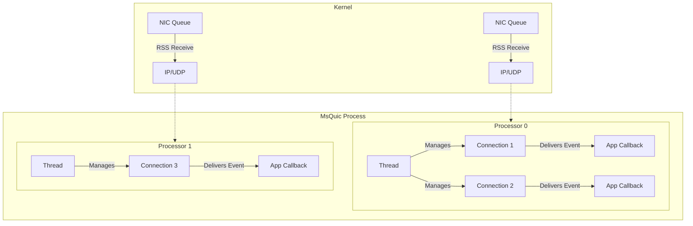

Execution
======

The MsQuic API uses a different execution model compared to BSD-style sockets and most other networking libraries built on them.
The sections below detail the designs MsQuic uses and the reasons behind these choices.

## Event Model

In the MsQuic API, all asynchronous state changes and notifications are indicated directly to the application via a callback.
This includes connection state changes, new streams being created, stream data being received, and stream sends completing.

```c
typedef struct QUIC_LISTENER_EVENT {
    QUIC_LISTENER_EVENT_TYPE Type;
    union {
        struct { ... } NEW_CONNECTION;
        struct { ... } STOP_COMPLETE;
    };
} QUIC_LISTENER_EVENT;

typedef
_IRQL_requires_max_(PASSIVE_LEVEL)
_Function_class_(QUIC_LISTENER_CALLBACK)
QUIC_STATUS
(QUIC_API QUIC_LISTENER_CALLBACK)(
    _In_ HQUIC Listener,
    _In_opt_ void* Context,
    _Inout_ QUIC_LISTENER_EVENT* Event
    );
```

Above is an example of a callback delivered to the listener interface.
The application must register a per-object callback handler to manage all events MsQuic may indicate for that object, returning a status to show if it was successfully handled or not.

This approach differs significantly from sockets and most networking libraries, where the application must make a call (e.g., `send` or `recv`) to determine if something happened.
This design choice was made for several reasons:

- The MsQuic API **runs in-process**, eliminating the need for a kernel to user mode boundary switch to notify the application layer. This makes the callback-based design more practical compared to sockets.

- MsQuic, due to the QUIC protocol, has numerous event types. Applications may have hundreds of objects with potential state changes. The callback model allows the application to avoid managing pending calls on each object.

- Writing correct, scalable code on top of the socket interfaces has proven challenging. By offloading the threading to MsQuic it enables MsQuic to abstract much complexity from applications, making things "just work" out of the box.

- It simplifies MsQuic's logic by eliminating the need for a queue or cached state to indicate to the application. In the socket model, the networking stack must wait for a top-down call from the application before indicating completion, increasing code size, complexity, and memory usage.

### Writing Event Handlers

Event handlers are **essential** for all objects that support them, as much of the MsQuic API operates through these callbacks.
Critical events, such as "shutdown complete" notifications, provide vital information necessary for the application to function correctly.
Without these events, the application cannot determine when it is safe to clean up objects.

Applications should keep the execution time within callbacks **to a minimum**.
MsQuic does not use separate threads for protocol execution and upcalls to the application.
Therefore, any significant delays in the callback **will delay the protocol**.
Any substantial work required by the application should be performed on its own thread.

This does not mean the application cannot perform any work in the callback handler.
In fact, many operations are designed to be most efficient when executed within the callback.
For example, closing a handle to a connection or stream is ideally done during the "shutdown complete" indication.

A crucial aspect of this design is that all blocking API (down) calls invoked within a callback always occur inline (to prevent deadlocks) and will take precedence over any calls in progress or queued from a separate thread.
It's also worth noting that MsQuic will not invoke a recursive callback to the application by default in these cases.
The one exception to this rule is if the application opts in via the `QUIC_STREAM_SHUTDOWN_FLAG_INLINE` flag when calling `StreamShudown` on a callback.

## Threading

By default, MsQuic creates its own threads to manage the execution of its logic.
The number and configuration of these threads depend on the settings passed to [RegistrationOpen](api/RegistrationOpen.md) or `QUIC_PARAM_GLOBAL_EXECUTION_CONFIG`.

Typically, MsQuic creates dedicated threads for each processor, which are hard-affinitized to a specific NUMA node and soft-affinitized (set as 'ideal processor') to a specific processor.
These threads handle both the datapath (i.e., UDP) and QUIC layers.
By default both layers are handled by a single thread (per-processor), but QUIC may be configured to run these layers on separate threads.
By using the same thread MsQuic can achieve lower latency, but by using separate threads it can achieve higher throughput.
MsQuic aligns its processing logic with the rest of the networking stack (including hardware RSS) to ensure that all processing stays on the same NUMA node, and ideally, the same processor.

The complexity of aligning processing across various threads and processors is why MsQuic manages its own threading by default.
This abstraction simplifies the development process for applications built on top of MsQuic, ensuring that things "just work" for QUIC out of the box.

Each thread manages the execution of one or more connections.
Connections are distributed across threads based on their RSS alignment, which should evenly distribute traffic based on different UDP tuples.
Each connection and its derived state (i.e., streams) are managed and executed by a single thread at a time, but may move across threads to align with any RSS changes.
This ensures that each connection and its streams are effectively single-threaded, including all upcalls to the application layer.
MsQuic will **never** make upcalls for a single connection or any of its streams in parallel.

For listeners, the application callback will be called in parallel for new connections, allowing server applications to scale efficiently with the number of processors.


