# Trouble Shooting Guide

This document is meant to be a step-by-step guide for trouble shooting any issues while using MsQuic.

## What kind of Issue are you having?

1. [I am debugging a crash.](#debugging-a-crash)
2. [Something is not functionally working as I expect.](#trouble-shooting-a-functional-issue)
3. [Performance is not what I expect it to be.](#trouble-shooting-a-performance-issue)

# Debugging a Crash

> TODO

# Trouble Shooting a Functional Issue

1. [I am getting an error code I don't understand.](#understanding-error-codes)
2. [The connection is unexpectedly shutting down.](#why-is-the-connection-shutting-down)
3. [No application (stream) data seems to be flowing.](#why-isnt-application-data-flowing)
4. [Why is this API failing?](#why-is-this-api-failing)
5. [An MsQuic API is hanging.](#why-is-the-api-hanging-or-deadlocking)
6. [I am having problems with SMB over QUIC.](#trouble-shooting-smb-over-quic-issues)

## Understanding Error Codes

Some error codes are MsQuic specific (`QUIC_STATUS_*`), and some are simply a passthrough from the platform. You can find the MsQuic specific error codes in the platform specific header ([msquic_posix.h](../src/inc/msquic_posix.h), [msquic_winkernel.h](../src/inc/msquic_winkernel.h), or [msquic_winuser.h](../src/inc/msquic_winuser.h)).

From [msquic_winuser.h](../src/inc/msquic_winuser.h):
```C
#define QUIC_STATUS_ADDRESS_IN_USE          HRESULT_FROM_WIN32(WSAEADDRINUSE)               // 0x80072740
#define QUIC_STATUS_CONNECTION_TIMEOUT      ERROR_QUIC_CONNECTION_TIMEOUT                   // 0x80410006
#define QUIC_STATUS_CONNECTION_IDLE         ERROR_QUIC_CONNECTION_IDLE                      // 0x80410005
#define QUIC_STATUS_UNREACHABLE             HRESULT_FROM_WIN32(ERROR_HOST_UNREACHABLE)      // 0x800704d0
#define QUIC_STATUS_INTERNAL_ERROR          ERROR_QUIC_INTERNAL_ERROR                       // 0x80410003
```

For more info, see the [Well Known Status Codes](./api/QUIC_STATUS.md#well-known-status-codes).

### Linux File Handle Limit Too Small

In many Linux setups, the default per-process file handle limit is relatively small (~1024). In scenarios where lots of (usually client) connection are opened, a large number of sockets (a type of file handle) are created. Eventually the handle limit is reached and connections start failing (error codes `0x16` or `0xbebc202`) because new sockets cannot be created. To fix this, you will need to increase the handle limit.

To query the maximum limit you may set:
```
ulimit -Hn
```

To set a new limit (up to the max):
```
ulimit -n newValue
```

## Why is the connection shutting down?

1. [What does this QUIC_CONNECTION_EVENT_SHUTDOWN_INITIATED_BY_TRANSPORT event mean?](#understanding-shutdown-by-transport)
2. [What does this QUIC_CONNECTION_EVENT_SHUTDOWN_INITIATED_BY_APP event mean?](#understanding-shutdown-by-app)

### Understanding shutdown by Transport.

There are two ways for a connection to be shutdown, either by the application layer or by the transport layer (i.e. the QUIC layer). The `QUIC_CONNECTION_EVENT_SHUTDOWN_INITIATED_BY_TRANSPORT` event occurs when the transport shuts the connection down. Generally, the transport shuts down the connection either when there's some kind of error or if the negotiated idle period has elapsed.

```
[2]6F30.34B0::2021/04/13-09:22:48.297449100 [Microsoft-Quic][conn][0x1CF25AC46B0] Transport Shutdown: 18446744071566327813 (Remote=0) (QS=1)
```

Above is an example event collected during an attempt to connect to a non-existent server. Eventually the connection failed and the transport indicated the event with the appropriate error code. This error code (`18446744071566327813`) maps to `0xFFFFFFFF80410005`, which specifically refers to the `QUIC_STATUS` (indicated by `QS=1`) for `0x80410005`; which indicates `ERROR_QUIC_CONNECTION_IDLE`. For more details for understanding error codes see [here](#understanding-error-codes).

### Understanding shutdown by App.

As indicated in [Understanding shutdown by Transport](#understanding-shutdown-by-transport), there are two ways for connections to be shutdown. The `QUIC_CONNECTION_EVENT_SHUTDOWN_INITIATED_BY_APP` event occurs when the peer application has explicitly shut down the connection. In MsQuic API terms, this would mean the app called [ConnectionShutdown](./api/connectionshutdown.md).

> TODO - Add an example event

The error code indicated in this event is completely application defined (type of `QUIC_UINT62`). The transport has no understanding of the meaning of this value. It never generates these error codes itself. So, to map these values to some meaning will require the application protocol documentation.

## Why isn't application data flowing?

Application data is exchanged via [Streams](./Streams.md) and queued by the app via [StreamSend](./api/StreamSend.md). The act of queuing data doesn't mean it will be immediately sent to the peer. There are a number of things that can block or delay the exchange. The `QUIC_FLOW_BLOCK_REASON` enum in [quic_trace.h](../src/inc/quic_trace.h) contains the full list of reasons that data may be blocked. Below is a short explanation of each:

Value | Meaning
--- | ---
**QUIC_FLOW_BLOCKED_SCHEDULING**<br>1 | The cross-connection scheduling logic has determined that too much work is queued on the connection to be processed all at once. Generally, this means we are CPU-bound.
**QUIC_FLOW_BLOCKED_PACING**<br>2 | Data burst sizes into the network are being limited and periodically sent into the network based on the congestion control's pacing logic.
**QUIC_FLOW_BLOCKED_AMPLIFICATION_PROT**<br>4 | The peer has not proved ownership of their IP address and therefore we are locally limiting the amount of data to send to it.
**QUIC_FLOW_BLOCKED_CONGESTION_CONTROL**<br>8 | Congestion control has determined that the network cannot handle any more data currently.
**QUIC_FLOW_BLOCKED_CONN_FLOW_CONTROL**<br>16 | The connection-wide limit for the amount of data that can be buffered or accepted by the peer at this time has been reached.
**QUIC_FLOW_BLOCKED_STREAM_ID_FLOW_CONTROL**<br>32 | The limit on the number of streams the peer can accept has been reached.
**QUIC_FLOW_BLOCKED_STREAM_FLOW_CONTROL**<br>64 | The limit on the amount of data that can be buffered or accepted by the peer for this stream has been reached.
**QUIC_FLOW_BLOCKED_APP**<br>128 | All data queued by the application on this stream has been sent. No more data is available to send.

Internally, MsQuic tracks these flags at all times for every connection and stream. Whenever any of them change, MsQuic logs an event. For example:

```
[0]0004.0F54::2021/05/14-10:30:22.541024000 [Microsoft-Quic][strm][0xC16BA610] Send Blocked Flags: 128
```

This event indicates that stream `C16BA610` only has the `QUIC_FLOW_BLOCKED_APP` flag, so it is currently blocked because there is no more application data queued to be sent.

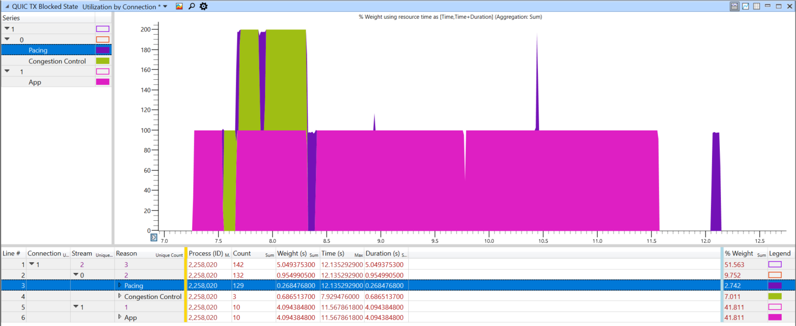

The [QUIC WPA plugin](../src/plugins/trace/README.md) also supports visualizing these blocked states via the `QUIC TX Blocked State` graph. It allows you to see what flags are blocking the connection as a whole (shown as stream 0) and what is blocking each individual stream, over the lifetime of the whole connection.

For instance, in the image above, you can see the stream (1) is blocked most of the time because there is no application data. Beyond that, the connection ("stream" 0) alternated between pacing and congestion control as the blocked reasons.

## Why is this API Failing?

The simplest way to determine exactly why a particular API is failing is via tracing. [Collect the traces](./Diagnostics.md#trace-collection) for the repro and convert them to text and open them in your favorite text editor (try [TextAnalysisTool](./Diagnostics.md#text-analysis-tool)!).

MsQuic logs every API entry and exit. Depending on the platform and tool used to decode the traces to text, you may either have the number or an enum represented as the API type (see `QUIC_TRACE_API_TYPE` in [quic_trace.h](../src/inc/quic_trace.h)), but all events look something like this:

```
[cpu][process.thread][time][ api] Enter <API Type> (<pointer>)
[cpu][process.thread][time][ api] Exit [optional status code]
```

A [TextAnalysisTool](./Diagnostics.md#text-analysis-tool) filter (`api.tat`) is also included in [./docs/tat](./tat) to help quickly find all failed API calls.

### Example (ListenerStart failing with QUIC_STATUS_INVALID_STATE)

In a recent example, we wanted to know why an app occasionally received `QUIC_STATUS_INVALID_STATE` when it called `ListenerStart`. We took the following steps to diagnose it.

1. Collected traces for the repro.
2. Converted to text and opened them in [TextAnalysisTool](./Diagnostics.md#text-analysis-tool).
3. Added a filter for all API enter events for `QUIC_TRACE_API_LISTENER_START` (`10`).
4. Looked for the following `[ api] Exit` event after each enter event on the same `[process.thread]`.

This quickly resulted in the following pair of events. They show the app called `ListenerStart` for the listener pointer `7f30ac0dcff0` at `09:54:03.528362` in process `2e73` on thread `2e8b` (CPU 1). Shortly after, MsQuic returned with status `200000002` (`QUIC_STATUS_INVALID_STATE` on Posix platforms).

```
[1][2e73.2e8b][09:54:03.528362][ api] Enter 10 (0x7f30ac0dcff0).
[1][2e73.2e8b][09:54:03.528913][ api] Exit 200000002
```

From here, we simply went backwards from the exit event to find any errors; and came up with the full set of important traces:

```
[1][2e73.2e8b][09:54:03.528362][ api] Enter 10 (0x7f30ac0dcff0).
[1][2e73.2e8b][09:54:03.528902][bind][0x7f30b80394e0] Listener (0x7f30ac076d90) already registered on ALPN
[1][2e73.2e8b][09:54:03.528903][list][0x7f30ac0dcff0] ERROR, "Register with binding".
[1][2e73.2e8b][09:54:03.528913][ api] Exit 200000002
```

This clearly shows that listener `7f30ac0dcff0` failed to register with the binding (i.e. UDP socket abstraction) because listener `7f30ac076d90` was already registered for the same ALPN. MsQuic only allows a single listener to be registered for a given ALPN on a local IP address and port.

## Why is the API hanging or deadlocking?

First, a bit of background. The MsQuic API has two types of APIs:

- **Blocking / Synchronous** - These APIs run to completion and only return once finished. When running in the Windows kernel, these **MUST NOT** be called at `DISPATCH_LEVEL`. They are denoted by the `_IRQL_requires_max_(PASSIVE_LEVEL)` annotation. For example, [ConnectionClose](./api/ConnectionClose.md).
- **Nonblocking / Asynchronous** - These APIs merely queue work and return immediately. When running in the Windows kernel, these may be called at `DISPATCH_LEVEL`. They are denoted by the `_IRQL_requires_max_(DISPATCH_LEVEL)` annotation. For example, [StreamSend][./api/StreamSend.md].

Additional documentation on the MsQuic execution model is available [here](./API.md#execution-mode).

Now, back to the problem. The app is calling into an MsQuic API and it is hanging and likely deadlocked. This can only happen for **synchronous** APIs. What do you do next? Generally, this is because the app is breaking one of the following rules:

1. Do not block the MsQuic thread/callback for any length of time. You may acquire a lock/mutex, but you must guarantee very quick execution. Do not grab a lock that you also hold (on a different thread) when calling back into MsQuic.
2. Do not call MsQuic APIs cross-object on MsQuic the thread/callbacks. For instance, if you're in a callback for Connection A, do not call [ConnectionClose](./api/ConnectionClose.md) for Connection B.

To verify exactly what is happening, [Collect the traces](./Diagnostics.md#trace-collection) and open then up in a text editor (ideally [TextAnalysisTool](./Diagnostics.md#text-analysis-tool)). The simplest way forward from here is to filter the logs based on the pointer of the object you are calling the API on. For instance, if you are calling [ConnectionClose](./api/ConnectionClose.md) on `0x7fd36c0019c0`, then add a filter for `7fd36c0019c0`. Here is an example (filtered) log for just such a case:

```
[0][53805.5381b][11:22:52.896762][ api] Enter 13 (0x7fd36c0019c0).

[0][53805.53815][11:22:52.896796][conn][0x7fd36c0019c0] Scheduling: 2
[0][53805.53815][11:22:52.896797][conn][0x7fd36c0019c0] Execute: 1
[0][53805.53815][11:22:52.896797][conn][0x7fd36c0019c0] Recv 1 UDP datagrams
[0][53805.53815][11:22:52.896825][conn][0x7fd36c0019c0] IN: BytesRecv=2901
[0][53805.53815][11:22:52.896826][conn][0x7fd36c0019c0] Batch Recv 1 UDP datagrams
[0][53805.53815][11:22:52.896854][strm][0x7fd378028360] Created, Conn=0x7fd36c0019c0 ID=0 IsLocal=0
[0][53805.53815][11:22:52.896856][conn][0x7fd36c0019c0] Indicating QUIC_CONNECTION_EVENT_PEER_STREAM_STARTED [0x7fd378028360, 0x0]

[1][53805.53813][11:22:53.142398][conn][0x7fd36c0019c0] Queuing 1 UDP datagrams
[1][53805.53813][11:22:53.392819][conn][0x7fd36c0019c0] Queuing 1 UDP datagrams
[1][53805.53813][11:22:53.644259][conn][0x7fd36c0019c0] Queuing 1 UDP datagrams
```

You will notice 3 different threads (seen in `[0][53805.X]`):

- `5381b` - The app thread that is calling in to close the connection.
- `53815` - The MsQuic worker thread that drives execution for the connection.
- `53813` - The MsQuic UDP thread that is processing received packets and queuing them on the connection.

As you can see, the last event/log on the MsQuic worker thread was an indication of a `QUIC_CONNECTION_EVENT_PEER_STREAM_STARTED` event to the app. There are no further events on this thread (easily verified by adding an additional filter for `[53805.53815]`). So, the app must be blocking this thread. The most likely scenario is that the app is holding a lock while calling [ConnectionClose](./api/ConnectionClose.md) on thread `5381b` and then in thread `53815`, the app is trying to acquire the same lock.

The solution here is that the app **must not** hold the lock when it calls into the blocking API, if that lock may also be acquired on the MsQuic thread.

## Trouble Shooting SMB over QUIC issues

To troubleshoot any SMB over QUIC issues on windows platforms, the best way is to collect SMB and QUIC traces and sharing it with SMB developers. Following are the steps:

```
Copy msquic/scripts/t.cmd to a local folder.

For SMB Client (a.k.a. RDR) WPP traces
t.cmd clion
// repro and get the relevant error.
t.cmd off
 
For SMB Server WPP traces
t.cmd srvon
// repro and get the relevant error.
t.cmd off

Share the generated cab file with SMB developers.
```

# Trouble Shooting a Performance Issue

1. [Is it a problem with just a single (or very few) connection?](#why-in-performance-bad-for-my-connection)
2. [Is it a problem multiple (lots) of connections?](#why-is-performance-bad-across-all-my-connections)

## Why is Performance bad for my Connection?

1. [Where is the CPU being spent for my connection?](#analyzing-cpu-usage)
2. [What is limiting throughput for my connection?](#finding-throughput-bottlenecks)

### Analyzing CPU Usage

> **Important** - The following is specific to Windows OS.

It's extremely common that everything may be functional, but not just as fast as expected. So the normal next step is then to grab a performance trace for the scenario and then dive into the details to analyze what exactly is happening. When you're explicitly looking for where the CPU is spending its time in the scenario, you will need to collect CPU traces. One way to do this is to [use WPR](./Diagnostics.md#using-wpr-to-collect-traces) (with `Stacks.Light` profile).

Once you have the ETL, open it [in WPA](../src/plugins/trace/README.md) (MsQuic plugin is unnecessary). Then, go to the `Graph Explorer`, expand `Computation`, expand `CPU Usage (Sampled)` and open up `Utilization by Process, Thread, Stack`. The following is an example of a CPU trace a server in a client upload scenario:

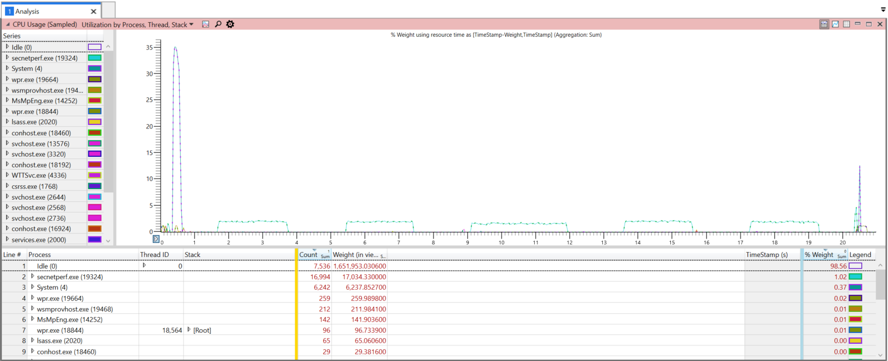

The next step is to filter things down to only the important information. First, select the relavent time period: click and drag over the area, right click, select `Zoom`.

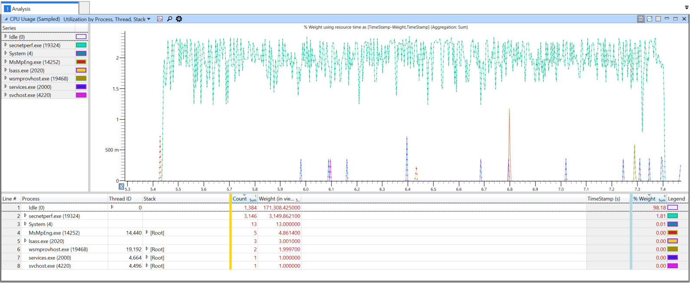

Then eliminate any unrelated "noise". The easiest way is to select all the Processes that have very little weight; then right click, and select `Filter Out Selection`. Another important thing to filter is the `[Idle]` stack under the `Idle (0)` process. Expact the `Thread ID` column for `Idle (0)`, right click the `[Idle]` row and then select `Filter Out Selection`. You should then be left with only the relavent CPU usage.

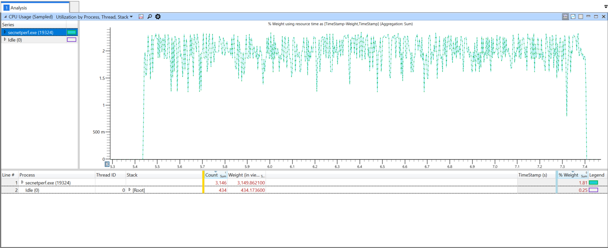

The current view now shows the CPU usage as a fraction of the total available CPU resources. Generally, the total available resources will include multiple (possibly many) different CPUs. So, it's a lot more helpful to get a per-CPU view. To see this, right click the table header (for instance, on `Process`), expand `More Columns ...`, and select `CPU`. Next, drag the `CPU` column to the front, before `Process`.

Initially, nothing will most likely show up in the graph view. You will need to manually enable the relavent CPUs. In this particular example, only CPUs 4 and 36 have any significant usage (as seen by `Count` or `Weight` columns). In the `Series` list in the graph view, click the boxes next to each relavent CPU series to enable it. You may also chose to explicitly filter out the CPUs that are irrelevant.

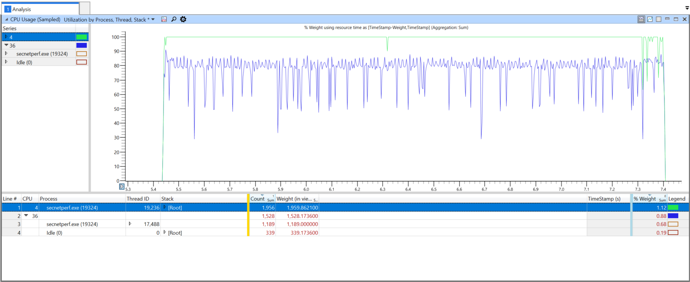

Now, you could use this view to dig into the various stacks by expanding the rows under the `Stack` column, but a better way is to change the view to a Flame Graph. Click the icon at the top to `Select chart type` and change it to `Flame`. Additionally, check the `Enable` box under it to enable filtering.

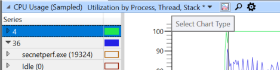

You can then slide the filter slider to change the level of filtering. In this example, after resizing the window some, it looks like this:

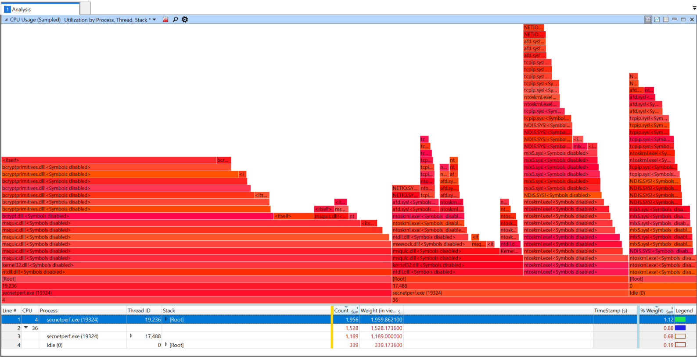

As you will immediately see, `<Symbols disabled>` shows up everywhere because symbols haven't been loaded. To load them, you will first need to configure the symbol path. You can do this by clicking on `Trace` in the top and then `Configure Symbol Path`. Then add any relavent paths to the list and close the window (hit `Ok`). Next you can load the symbols; `Trace` -> `Load Symbols`.

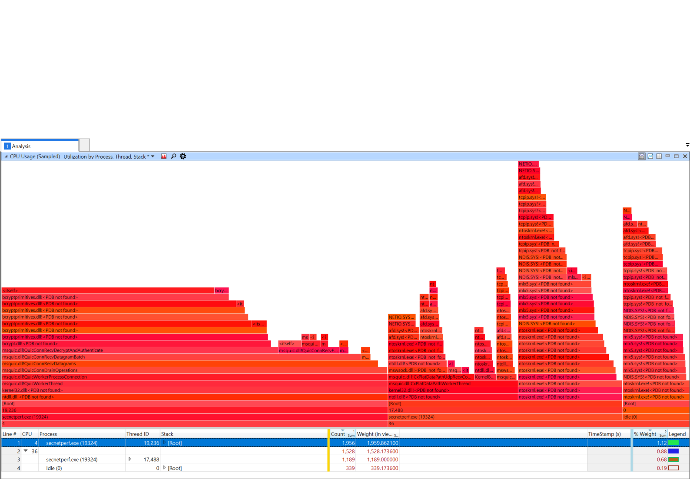

This example has just the `msquic.dll` and `secnetperf.exe` symbols loaded. You can then drill down to various various part of the flame, and zoom into them by right clicking on them and selecting `Filter To Flame`. Also, remember you can change the Flame filter slider at any time as well. For example, the following is what filtering to the `msquic.dll!QuicWorkerThread` flame.

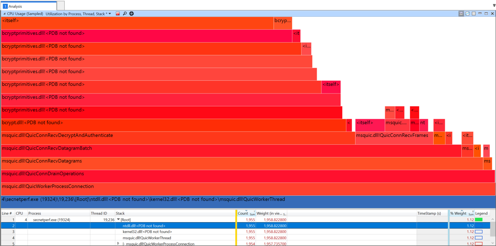

Since this flame was essentially all of CPU 4, whatever is taking the most significant CPU resources here can be blamed as the most significant cost of CPU resources. Practically, this comes down to `bcrypt.dll`. From experience, since this happens in `QuicConnRecvDecryptAndAuthenticate` this is the work related to decrypting the packet payloads (over 71% of the CPU!).

### Finding Throughput Bottlenecks

> TODO

## Why is Performance bad across all my Connections?

1. [The work load isn't spreading evenly across cores.](#diagnosing-rss-issues)

### Diagnosing RSS Issues

> **Important** - The following is specific to Windows OS.

For scenarios with lots of parallel connections, generally the work should be spread across all the available processors. But if there are issues with the work not spreading there are a few things you can do. First off, here's an example where the RPS tests were run to a server that should be able to handle near 1 million requests per second:

```
> secnetperf.exe -test:RPS -target:quic-server -conns:250 -requests:7500 -request:0 -response:4096 -runtime:20000
All Connected! Waiting for idle.
Start sending request...
Started!

Result: 25869 RPS, Min: 944, Max: 888078, 50th: 281889.000000, 90th: 369965.000000, 99th: 490582.000000, 99.9th: 574533.000000, 99.99th: 797810.000000, 99.999th: 884055.000000, 99.9999th: 888078.000000, StdErr: 91.224221
App Main returning status 0
```

As you can see from the output of `secnetperf.exe` the resulting `25869 RPS` is nowhere near what it should be. The next step is to grab a performance trace to see what is going on. For these type of issues the best way to collect the traces would be to [use WPR](./Diagnostics.md#using-wpr-to-collect-traces) (with `Scheduling.Verbose` or `Performance.Verbose` profiles).

Once you have the ETL, open it [in WPA using the MsQuic plugin](../src/plugins/trace/README.md). First thing after opening, let's take a look at the QUIC Worker utilization. In the `Graph Explorer`, under `Computation`, expand `QUIC Workers` and open the one labeled `Utilization by Worker`. For the example above (server-side trace), here is what the output looks like:

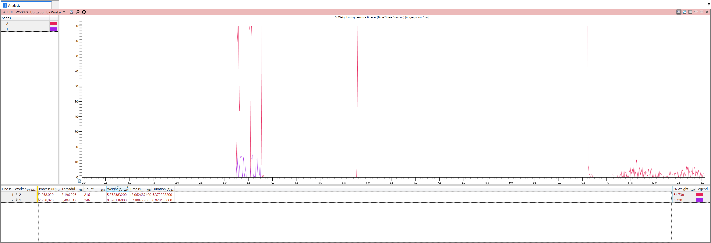

You can immediately see that only 2 different workers are being used, with worker `2` being used primarily.

> **In depth details** - MsQuic always uses at least two workers on the server side for per connection. The first worker is a global, shared worker that is used to do initial validation of the connection request. Its job is to figure out which app the incoming connection belongs to. Once that's complete, the connection will be handed off to that app (and its worker thread(s)). So, this is why you only see usage of worker `1` at the beginning of the trace.

The first usage spikes are from the RPS test initially connecting all its (250) parallel connections. There is a bit of back and forth to do the handshakes for these connections. Then there is an idle period while the test waits for things to die down. Finally, the actual RPS tests commense and that is where you see the solid usage of worker `2`.

Ideally, RPS tests should generate work that is spread across **many** different workers. The fact that only 1 worker is being used is definitely the source of the low RPS numbers that were measured and indicated in the tool output above. Since MsQuic picks which workers to use based on how the UDP datagrams are received, the next step is to look into the UDP receive layer.

One way to do this is by using the `Generic Events` table (under `System Activity` in the `Graph Explorer`). Open that up, and then filter to just MsQuic (also shows up as `ff15e657-4f26-570e-88ab-0796b258d11c` some times) `Provider Name` (Right Click -> `Filter To Selection`). Next, we're looking for specifically the datapath receive events, which are `Id` 9218. Filter to just those and we see something like this:

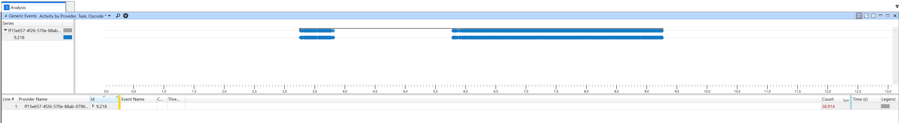

Now, what we're really interested in is what CPU these events are coming in on. So, add the CPU column to the left of the yellow bar. It doesn't really show a much different picture, but you can clearly see that all events happen on CPU 0.


Now, we can clearly see that all our receive events are happening on the same CPU. This definitely not supposed to happen in an environment where RSS should be spreading all the different incoming UDP flows/tuples to different processors.

The next step is to take a look at the RSS configuration on the machine to ensure things are properly configured. Run `Get-NetAdapterRss` to get an output like this:

```
Name                                            : Slot0A x8
InterfaceDescription                            : Mellanox ConnectX-3 Pro Ethernet Adapter
Enabled                                         : True
NumberOfReceiveQueues                           : 8
Profile                                         : Closest
BaseProcessor: [Group:Number]                   : 0:0
MaxProcessor: [Group:Number]                    : 1:38
MaxProcessors                                   : 8
RssProcessorArray: [Group:Number/NUMA Distance] : 0:0/0  0:2/0  0:4/0  0:6/0  0:8/0  0:10/0  0:12/0  0:14/0
                                                  0:16/0  0:18/0  0:20/0  0:22/0  0:24/0  0:26/0  0:28/0  0:30/0
                                                  0:32/0  0:34/0  0:36/0  0:38/0  1:0/32767  1:2/32767  1:4/32767
                                                  1:6/32767
                                                  1:8/32767  1:10/32767  1:12/32767  1:14/32767  1:16/32767
                                                  1:18/32767  1:20/32767  1:22/32767
                                                  1:24/32767  1:26/32767  1:28/32767  1:30/32767  1:32/32767
                                                  1:34/32767  1:36/32767  1:38/32767
IndirectionTable: [Group:Number]                : 0:0   0:2     0:4     0:6     0:8     0:10    0:12    0:14
                                                  0:0   0:2     0:4     0:6     0:8     0:10    0:12    0:14
                                                  0:0   0:2     0:4     0:6     0:8     0:10    0:12    0:14
                                                  0:0   0:2     0:4     0:6     0:8     0:10    0:12    0:14
                                                  0:0   0:2     0:4     0:6     0:8     0:10    0:12    0:14
                                                  0:0   0:2     0:4     0:6     0:8     0:10    0:12    0:14
                                                  0:0   0:2     0:4     0:6     0:8     0:10    0:12    0:14
                                                  0:0   0:2     0:4     0:6     0:8     0:10    0:12    0:14
                                                  0:0   0:2     0:4     0:6     0:8     0:10    0:12    0:14
                                                  0:0   0:2     0:4     0:6     0:8     0:10    0:12    0:14
                                                  0:0   0:2     0:4     0:6     0:8     0:10    0:12    0:14
                                                  0:0   0:2     0:4     0:6     0:8     0:10    0:12    0:14
                                                  0:0   0:2     0:4     0:6     0:8     0:10    0:12    0:14
                                                  0:0   0:2     0:4     0:6     0:8     0:10    0:12    0:14
                                                  0:0   0:2     0:4     0:6     0:8     0:10    0:12    0:14
                                                  0:0   0:2     0:4     0:6     0:8     0:10    0:12    0:14
```

The output above indicates RSS is configured with 8 queues, so there should be spreading of the incoming flows to 8 different CPUs (and then passed to 8 different workers) instead of just the 1 that we are seeing. So, finally, in cases where everything seems to be configured correctly, but things **still** aren't working, that usually indicates a problem with the network card driver. Make sure the driver is up to date with the latest version available. If that still doesn't fix the problem, you will likely need to contact support from the network card vendor.

