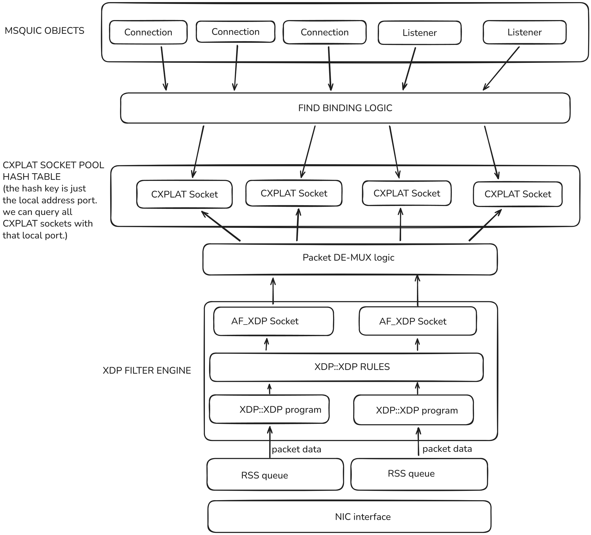

# MsQuic over XDP

To avoid confusion, "XDP" refers to [XDP-for-windows](https://github.com/microsoft/xdp-for-windows). While Linux XDP has been experimented
upon in the past and shown some promise for running MsQuic, it is NOT a stable datapath actively being maintained today.

## What is XDP

XDP enables received packets to completely bypass the OS networking stack.

Applications can subscribe to XDP ring buffers to post packets to send,
and process packets that are received through AF_XDP sockets.

Additionally, applications can program XDP to determine the
logic for which packets to filter for, and what to do with them.

For instance: "drop all packets with a UDP header and destination port
42."

## Port reservation logic

The type of logic MsQuic programs into XDP looks like:
 "redirect all packets with a destination port X to an AF_XDP socket."

This runs into the issue of **packet stealing.** If say there was an unrelated process
that binds an OS socket to the same port MsQuic used to program XDP, XDP will steal
that traffic from underneath it.

Which is why MsQuic will always create an OS UDP socket on the same port as the AF_XDP
socket to play nice with the rest of the stack.

There are *exceptions* to this port reservation.

- Sometimes, MsQuic may create a TCP OS socket instead, or both TCP and UDP (see [QTIP](./QTIP.md)).
- Sometimes, MsQuic may NOT create any OS sockets at all (see [CIBIR](./CIBIR.md)).

## MsQuic over XDP general architecture:

