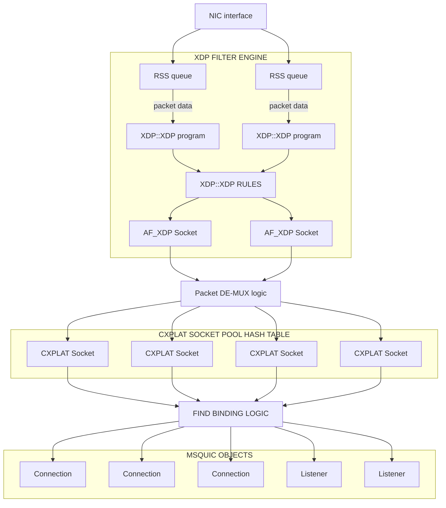

# MsQuic over XDP

To avoid confusion, "XDP" refers to [XDP-for-windows](https://github.com/microsoft/xdp-for-windows).
MsQuic does not support Linux XDP as a datapath.

## Installing XDP

MsQuic consumes XDP as a binary dependency for its tests; it does not build XDP
from source. The available packages — and the exact version pinned for each — are
defined in [`scripts/xdp.json`](../scripts/xdp.json), which is the single source
of truth. Each entry is keyed by a version moniker (e.g. `1.1`, `prerelease`).

To install XDP for testing, use `prepare-machine.ps1`, which downloads the
runtime NuGet package, extracts it, and installs the driver via the package's
own `xdp-setup.ps1`:

```powershell
# Install the official (production-signed) XDP release.
./scripts/prepare-machine.ps1 -ForTest -UseXdp xdp-v1.1

# Install a test-signed prerelease XDP package (requires test signing enabled).
./scripts/prepare-machine.ps1 -ForTest -UseXdp xdp-prerelease
```

`-UseXdp` takes the version moniker to install (any key from `xdp.json`); omit it
to skip XDP entirely.

## What is XDP

XDP enables received packets to completely bypass the OS networking stack.

Applications can subscribe to XDP ring buffers to post packets to send,
and process packets that are received through AF_XDP sockets.

Additionally, applications can program XDP to determine the
logic for which packets to filter for, and what to do with them.

For instance: "drop all packets with a UDP header and destination port
42."

## Port reservation logic

The type of logic MsQuic programs into XDP looks like:
 "redirect all packets with a destination port X to an AF_XDP socket."

This runs into the issue of **packet stealing.** If there was an unrelated process
that binds an OS socket to the same port MsQuic used to program XDP, XDP will steal
that traffic from underneath it.

Which is why MsQuic will always create an OS UDP socket on the same port as the AF_XDP
socket to play nice with the rest of the stack.

There are *exceptions* to this port reservation.

- Sometimes, MsQuic may create a TCP OS socket instead, or both TCP and UDP (see [QTIP](./QTIP.md)).
- Sometimes, MsQuic may NOT create any OS sockets at all (see [CIBIR](./CIBIR.md)).


## MsQuic over XDP general architecture:


```mermaid
flowchart TB

%% =========================
%% NIC + RSS
%% =========================
NIC["NIC interface"]

RSS1["RSS queue"]
RSS2["RSS queue"]

NIC --> RSS1
NIC --> RSS2

%% =========================
%% XDP FILTER ENGINE
%% =========================
subgraph XDP_ENGINE["XDP FILTER ENGINE"]

    XDP_PROG1["XDP::XDP program"]
    XDP_PROG2["XDP::XDP program"]

    XDP_RULES["XDP::XDP RULES"]

    AFXDP1["AF_XDP Socket"]
    AFXDP2["AF_XDP Socket"]

    RSS1 -->|packet data| XDP_PROG1
    RSS2 -->|packet data| XDP_PROG2

    XDP_PROG1 --> XDP_RULES
    XDP_PROG2 --> XDP_RULES

    XDP_RULES --> AFXDP1
    XDP_RULES --> AFXDP2

end

%% =========================
%% PACKET DEMUX
%% =========================
DEMUX["Packet DE-MUX logic"]

AFXDP1 --> DEMUX
AFXDP2 --> DEMUX

%% =========================
%% CXPLAT SOCKET POOL
%% =========================
subgraph CXPLAT_POOL["CXPLAT SOCKET POOL HASH TABLE"]

    CX1["CXPLAT Socket"]
    CX2["CXPLAT Socket"]
    CX3["CXPLAT Socket"]
    CX4["CXPLAT Socket"]

end

DEMUX --> CX1
DEMUX --> CX2
DEMUX --> CX3
DEMUX --> CX4

%% =========================
%% FIND BINDING LOGIC
%% =========================
BIND["FIND BINDING LOGIC"]

CX1 --> BIND
CX2 --> BIND
CX3 --> BIND
CX4 --> BIND

%% =========================
%% MSQUIC OBJECTS
%% =========================
subgraph MSQUIC_OBJECTS["MSQUIC OBJECTS"]

    CONN1["Connection"]
    CONN2["Connection"]
    CONN3["Connection"]
    LIST1["Listener"]
    LIST2["Listener"]

end

BIND --> CONN1
BIND --> CONN2
BIND --> CONN3
BIND --> LIST1
BIND --> LIST2
```

## Using XDP maps

The XDP maps feature is introduced in XDP v1.4 to de-couple AF_XDP socket
users from privileged XDP rule setters.

MsQuic version v2.5 (and below) currently serves 2 simultaneous roles:
- AF_XDP socket creator and user
- Privileged XDP rule setter

MsQuic version v2.6 (and beyond) will begin to leverage XDP maps, and expose APIs for applications wishing to harden their security
posture and reduce their threat surface by de-coupling.

The intention with de-coupling is to have a trusted process create rules and maps, isolating the untrusted process(es) from each other and the rest of the system.

### API

Using XDP maps is configured via a global `SetParam` call using the
`QUIC_PARAM_GLOBAL_XDP_MAP_CONFIG` parameter.
Find it in the [Global Parameters](./Settings.md#global-parameters) table.


### Usage example

Below is the general skeleton for XDP map usage with MsQuic.
For a detailed comprehensive example, see [this sample](https://TODO_jackhe_fix_this) 

```c
//
// Rule and map producer (in a trusted process)
//

HANDLE XskMap;
if (FAILED(XdpMapCreate(&XskMap, XDP_MAP_TYPE_XSKMAP))) { exit(-1) };
XDP_RULE Rule = {
    .Match = XDP_MATCH_UDP_DST,
    .Pattern.Port = htons(ServerPort),
    .Action = XDP_PROGRAM_ACTION_REDIRECT,
    .Redirect.TargetType = XDP_REDIRECT_TARGET_TYPE_XSKMAP_BY_QUEUEID,
    .Redirect.Target = XskMap,
};
XdpCreateProgram(IfIndex, &RxHook, QueueId, 0, &Rule, 1, &Program);

DuplicateHandleAndShareWithConsumer(XskMap);

//
// MsQuic AF_XDP socket consumer 
//
// (maybe in another, less trusted process...
//  or, in the same trusted process...)
//

QUIC_XDP_MAP_HANDLE XskMap = GetMapHandleFromSomewhere();

MsQuicOpenVersion(QUIC_API_VERSION, &MsQuic);
QUIC_XDP_MAP_CONFIG MapConfig = {
    .InterfaceIndex = IfIndex,
    .MapHandle = XskMap,
};
MsQuic->SetParam(
    NULL,
    QUIC_PARAM_GLOBAL_XDP_MAP_CONFIG,
    sizeof(MapConfig),
    &MapConfig);

//
// Now open registrations / listeners / connections as normal.
// MsQuic will not set rules, and instead associate XSKs with the given map
// handles and expect RX traffic to arrive via the maps.
//
MsQuic->RegistrationOpen(&RegConfig, &Registration);
```
