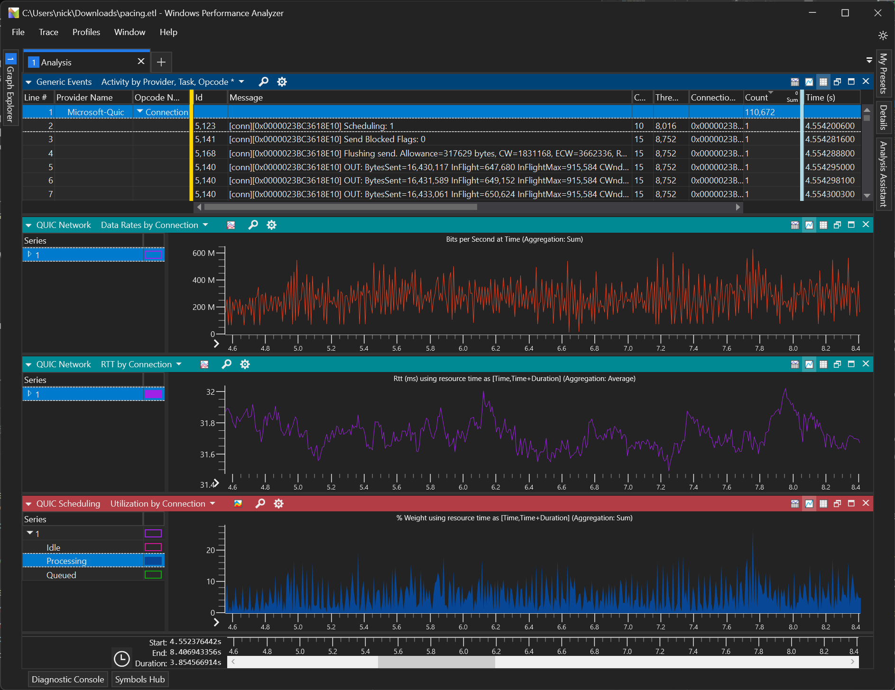
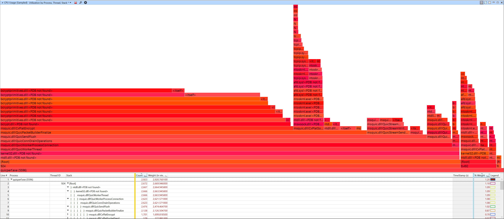
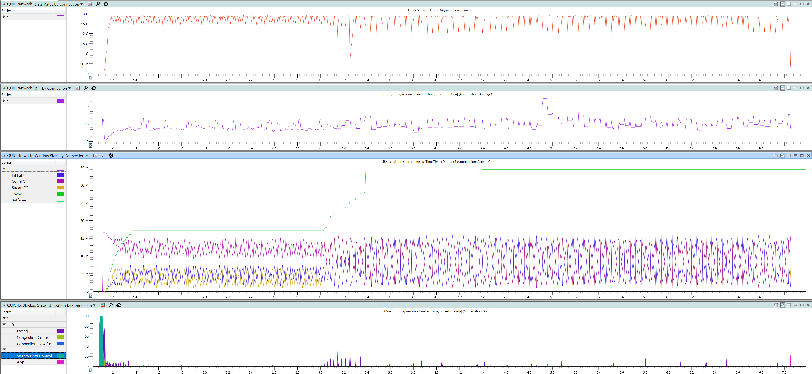

# Windows Performance Analyzer Plugin

This page provides the install, setup and usage instructions for Windows Performance Analyzer (WPA) and use it to analyze MsQuic traces.

# Install Instructions

The following are currently only possible on Windows. Other platforms may be supported by WPA in the future.

The easiest way to use WPA is via the `./scripts/wpa.ps1` script, but additional detailed instructions can be found below.

## Install WPA

1. Download the preview version from [the Windows Store](https://www.microsoft.com/store/productId/9N58QRW40DFW).
2. You should then be able to run WPA from: `$env:LOCALAPPDATA\Microsoft\WindowsApps\wpa.exe`

## Install MsQuic WPA Plugin

1. Build the plugin via `QuicTrace.sln` or download it from the latest release (i.e. [v1.0.0](https://github.com/microsoft/msquic/releases/download/v1.0.0-129524/quic.wpa.zip)).
2. Update/create your WPA shortcut by adding `-addsearchdir <path_to_quic_plugin_folder>`.

# Usage Instructions

WPA is extremely powerful. It can operate very quickly on multi-gigabyte trace files and let you slice & dice the data many different ways to really drill down into what's going on.

## Stacks CPU Usage

One of the built-in capabilities of WPA is the ability to analyze CPU trace information to see the CPU usage of the various call stacks in the code. For instance, in the above Flame Graph you can easily see that the most expensive function (58% of total CPU usage!) is `CxPlatEncrypt`.

**TODO** - Add more details/instructions.

## QUIC Charts and Tables

**TODO**