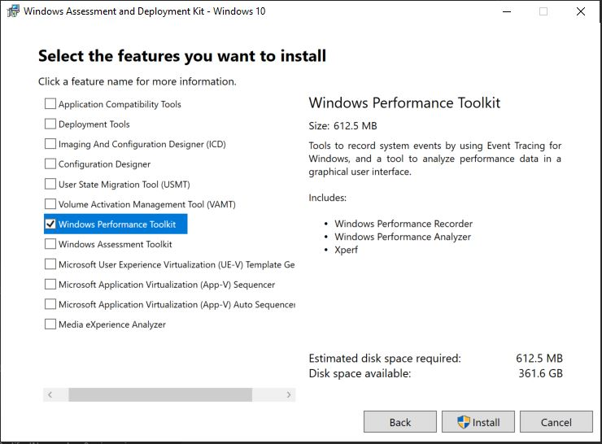
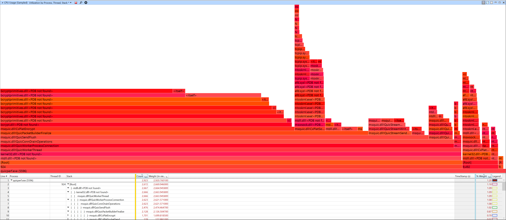

This page provides the install, setup and usage instructions for Windows Performance Analyzer (WPA) and use it to analyze MsQuic traces.

# Install Instructions

The following are currently only possible on Windows. Other platforms may be supported by WPA in the future.

## Install WPA

1. Download the latest the [ADK Preview](https://www.microsoft.com/en-us/software-download/windowsinsiderpreviewADK) to get the Windows Performance Toolkit (WPT).
   - Note: In the future, the WPA team plans to make it easier to install WPA outside of the ADK
2. Install the Windows Performance Toolkit 
3. Verify that this WPA version supports plugins
    - In Command Prompt
        ```dos
        "C:\Program Files (x86)\Windows Kits\10\Windows Performance Toolkit\wpa.exe" /?
        ```
    - Verify that these 2 command line WPA options are supported:
      - OPTIONS: **-addsearchdir PATH**. Adds a directory path to the plugin search path. ....
      - ENVIRONMENT VARIABLES: **WPA_ADDITIONAL_SEARCH_DIRECTORIES** - A semicolon (;) delimited list of additional directories to search for plugins. Equivalent to the -addsearchdir option.

## Install MsQuic WPA Plugin

1. Build the plugin via `QuicEventDataSource.csproj` or download it from the latest release (i.e. [v1.0.0](https://github.com/microsoft/msquic/releases/download/v1.0.0-129524/quic.wpa.zip)).
2. Update/create your WPA shortcut by adding `-addsearchdir <path_to_quic_plugin_folder>`.

# Usage Instructions

WPA is extremely powerful. It can operate very quickly on multi-gigabyte trace files and let you slice & dice the data many different ways to really drill down into what's going on.

## Stacks CPU Usage



One of the built-in capabilities of WPA is the ability to analyze CPU trace information to see the CPU usage of the various call stacks in the code. For instance, in the above Flame Graph you can easily see that the most expensive function (58% of total CPU usage!) is `CxPlatEncrypt`.

**TODO** - Add more details/instructions.

## QUIC Charts and Tables


**TODO**